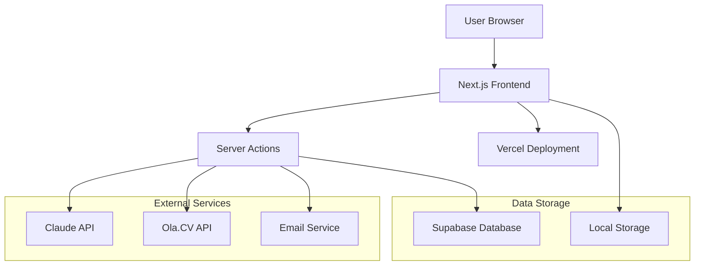

# Design Document

## Overview

LaunchKit is a Next.js 14 web application that transforms user bios into complete brand identities with live websites. The system uses AI-powered brand generation, domain registration via Ola.CV API, and automated site deployment to create a seamless "bio to brand in 60 seconds" experience.

The architecture follows a modern full-stack approach with server-side rendering, server actions for secure API integration, and a component-based UI built with React and Tailwind CSS.

## Architecture

### High-Level Architecture



### Technology Stack

**Frontend:**
- Next.js 14 with App Router
- React 18 with TypeScript
- Tailwind CSS for styling
- Framer Motion for animations
- React Context for state management

**Backend:**
- Next.js Server Actions for API integration
- Supabase for database and authentication
- Server-side rendering for performance

**External Integrations:**
- Claude API (Anthropic) for AI brand generation
- Ola.CV API for domain registration and DNS management
- Vercel for deployment and hosting

## Components and Interfaces

### Core Components

#### 1. Bio Input Component (`BioInput.tsx`)
```typescript
interface BioInputProps {
  onSubmit: (data: BioData) => void;
  initialData?: BioData;
}

interface BioData {
  fullName: string;
  bio: string;
  email: string;
}
```

**Responsibilities:**
- Collect user input with validation
- Auto-save to localStorage
- Character limit enforcement (120 chars for bio)
- Email format validation

#### 2. Brand Generator Component (`BrandGenerator.tsx`)
```typescript
interface BrandGeneratorProps {
  bioData: BioData;
  onBrandSelect: (brand: BrandIdentity) => void;
}

interface BrandIdentity {
  id: string;
  brandName: string;
  domain: string;
  colors: {
    primary: string;
    accent: string;
    neutral: string;
  };
  tagline: string;
  available: boolean;
}
```

**Responsibilities:**
- Display AI-generated brand options
- Show domain availability status
- Handle brand selection and customization
- Provide regeneration functionality

#### 3. Domain Selector Component (`DomainSelector.tsx`)
```typescript
interface DomainSelectorProps {
  brandIdentity: BrandIdentity;
  onDomainConfirm: (domain: string) => void;
}
```

**Responsibilities:**
- Display selected domain with pricing
- Show availability confirmation
- Handle domain reservation process

#### 4. Contact Form Component (`ContactForm.tsx`)
```typescript
interface ContactFormProps {
  onContactSubmit: (contact: ContactData) => void;
}

interface ContactData {
  name: string;
  email: string;
  phone: string;
  organization?: string;
  address: string;
  city: string;
  state?: string;
  postcode: string;
  country: string;
}
```

**Responsibilities:**
- Collect domain registration contact information
- Validate required fields per Ola.CV requirements
- Auto-detect country code from user location

#### 5. DNS Manager Component (`DNSManager.tsx`)
```typescript
interface DNSManagerProps {
  zoneId: string;
  domain: string;
}

interface DNSRecord {
  id?: string;
  type: 'A' | 'AAAA' | 'CNAME' | 'MX' | 'TXT' | 'SRV';
  name: string;
  content: string;
  ttl: number;
  priority?: number;
  comment?: string;
}
```

**Responsibilities:**
- Display current DNS records in table format
- Add/edit/delete DNS records
- Provide Gmail preset functionality
- Real-time DNS record validation

### Server Actions

#### 1. Brand Generation Actions
```typescript
// app/actions/brand.ts
'use server'

export async function generateBrandIdentities(bioData: BioData): Promise<BrandIdentity[]>
export async function checkDomainAvailability(domains: string[]): Promise<DomainAvailability[]>
export async function regenerateBrands(bioData: BioData, excludeNames: string[]): Promise<BrandIdentity[]>
```

#### 2. Domain Management Actions
```typescript
// app/actions/domain.ts
'use server'

export async function createContact(contactData: ContactData): Promise<string>
export async function registerDomain(domain: string, contactId: string): Promise<DomainRegistration>
export async function getDomainInfo(domainId: string): Promise<DomainInfo>
```

#### 3. DNS Management Actions
```typescript
// app/actions/dns.ts
'use server'

export async function getDNSZone(domainId: string): Promise<DNSZone>
export async function listDNSRecords(zoneId: string): Promise<DNSRecord[]>
export async function createDNSRecord(zoneId: string, record: DNSRecord): Promise<DNSRecord>
export async function updateDNSRecord(zoneId: string, recordId: string, record: DNSRecord): Promise<DNSRecord>
export async function deleteDNSRecord(zoneId: string, recordId: string): Promise<void>
export async function addGmailPreset(zoneId: string): Promise<DNSRecord[]>
```

## Data Models

### Database Schema (Supabase)

```sql
-- Users table (managed by Supabase Auth)
CREATE TABLE users (
  id UUID PRIMARY KEY DEFAULT gen_random_uuid(),
  email TEXT UNIQUE NOT NULL,
  created_at TIMESTAMP DEFAULT NOW(),
  updated_at TIMESTAMP DEFAULT NOW()
);

-- Brands table
CREATE TABLE brands (
  id UUID PRIMARY KEY DEFAULT gen_random_uuid(),
  user_id UUID REFERENCES users(id) ON DELETE CASCADE,
  name TEXT NOT NULL,
  domain TEXT UNIQUE NOT NULL,
  tagline TEXT,
  bio TEXT NOT NULL,
  colors JSONB NOT NULL, -- {primary, accent, neutral}
  template_type TEXT DEFAULT 'minimal-card',
  ola_domain_id TEXT,
  ola_contact_id TEXT,
  ola_zone_id TEXT,
  status TEXT DEFAULT 'draft', -- 'draft' | 'registering' | 'live' | 'failed'
  created_at TIMESTAMP DEFAULT NOW(),
  updated_at TIMESTAMP DEFAULT NOW()
);

-- Services table (for link-in-bio functionality)
CREATE TABLE services (
  id UUID PRIMARY KEY DEFAULT gen_random_uuid(),
  brand_id UUID REFERENCES brands(id) ON DELETE CASCADE,
  name TEXT NOT NULL,
  price TEXT,
  link TEXT NOT NULL,
  emoji TEXT,
  position INTEGER DEFAULT 0,
  visible BOOLEAN DEFAULT true,
  created_at TIMESTAMP DEFAULT NOW(),
  updated_at TIMESTAMP DEFAULT NOW()
);

-- Deployments table
CREATE TABLE deployments (
  id UUID PRIMARY KEY DEFAULT gen_random_uuid(),
  brand_id UUID REFERENCES brands(id) ON DELETE CASCADE,
  deployment_url TEXT NOT NULL,
  status TEXT DEFAULT 'building', -- 'building' | 'live' | 'failed'
  build_log TEXT,
  deployed_at TIMESTAMP,
  created_at TIMESTAMP DEFAULT NOW()
);
```

### TypeScript Interfaces

```typescript
// types/brand.ts
export interface Brand {
  id: string;
  userId: string;
  name: string;
  domain: string;
  tagline: string;
  bio: string;
  colors: {
    primary: string;
    accent: string;
    neutral: string;
  };
  templateType: 'minimal-card' | 'magazine-grid' | 'terminal-retro';
  olaDomainId?: string;
  olaContactId?: string;
  olaZoneId?: string;
  status: 'draft' | 'registering' | 'live' | 'failed';
  createdAt: string;
  updatedAt: string;
}

// types/ola.ts
export interface OlaContact {
  id: string;
  name: string;
  email: string;
  phone: string;
  organization?: string;
  address: string;
  city: string;
  state?: string;
  postcode: string;
  country: string;
}

export interface OlaDomain {
  id: string;
  domain: string;
  autoRenew: boolean;
  registeredAt: string;
  expiresAt: string;
}

export interface OlaDNSZone {
  id: string;
  domain: string;
  status: string;
}
```

## Correctness Properties

*A property is a characteristic or behavior that should hold true across all valid executions of a system—essentially, a formal statement about what the system should do. Properties serve as the bridge between human-readable specifications and machine-verifiable correctness guarantees.*

### Input Validation Properties

**Property 1: Bio Length Validation**
*For any* bio input exceeding 120 characters, the system should prevent submission and display character count feedback
**Validates: Requirements 1.2**

**Property 2: Email Format Validation**
*For any* email input, the system should validate the format before allowing progression to the next step
**Validates: Requirements 1.3**

**Property 3: Input Sanitization**
*For any* user input containing special characters or emojis, the system should sanitize the input to prevent XSS attacks
**Validates: Requirements 1.5, 10.2**

### Brand Generation Properties

**Property 4: Brand Generation Count**
*For any* valid bio submission, the Brand Generator should create exactly 3 distinct brand identities
**Validates: Requirements 2.1**

**Property 5: Brand Identity Completeness**
*For any* generated brand identity, it should include a brand name, color palette with 3 colors, and a tagline
**Validates: Requirements 2.2**

**Property 6: Domain-Friendly Brand Names**
*For any* generated brand name, it should contain only characters valid for domain registration (no special characters)
**Validates: Requirements 2.3**

**Property 7: Tagline Word Limit**
*For any* generated tagline, it should contain 10 words or fewer
**Validates: Requirements 2.4**

### Domain Management Properties

**Property 8: Domain Availability Check**
*For any* set of generated brand names, the system should check .cv domain availability for each name
**Validates: Requirements 3.1**

**Property 9: Contact Form Validation**
*For any* contact form submission, all required fields (name, email, address, phone) should be validated before API submission
**Validates: Requirements 4.2**

**Property 10: Contact ID Persistence**
*For any* successfully created contact, the contact ID should be stored and available for future domain operations
**Validates: Requirements 4.5**

### DNS Management Properties

**Property 11: DNS Record Validation**
*For any* DNS record input, the system should validate the record format before submission to the API
**Validates: Requirements 5.3**

**Property 12: DNS Zone Retrieval**
*For any* registered domain, the system should retrieve and display the DNS zone information
**Validates: Requirements 5.1**

### Site Generation Properties

**Property 13: Site Generation from Brand Identity**
*For any* selected brand identity, the Site Builder should generate a website incorporating the brand's colors, name, and content
**Validates: Requirements 6.1**

**Property 14: Template Selection**
*For any* brand identity generation, the Site Builder should select one of the 3 available templates (Minimal Card, Magazine Grid, Terminal Retro)
**Validates: Requirements 9.1**

**Property 15: Template Customization**
*For any* applied template, it should be customized with the user's specific brand colors and content
**Validates: Requirements 9.3**

### Dashboard and Service Management Properties

**Property 16: Service Link Validation**
*For any* service link addition, the system should validate the URL format and display it with pricing information
**Validates: Requirements 7.3, 8.1**

**Property 17: Free User Service Limit**
*For any* free user account, the system should enforce a maximum of 3 service links
**Validates: Requirements 7.4**

**Property 18: Service Card Display**
*For any* service, the dashboard should display a card containing name, price, and emoji icon
**Validates: Requirements 8.2**

### Security Properties

**Property 19: HTTPS Communication**
*For any* API communication, the system should use HTTPS protocol
**Validates: Requirements 10.3**

**Property 20: Rate Limiting**
*For any* API endpoint, the system should implement rate limiting to prevent abuse
**Validates: Requirements 10.5**

## Error Handling

### API Error Handling

**Ola.CV API Errors:**
- **Domain Registration Failures**: Implement exponential backoff retry (3 attempts max) with user notification
- **DNS Operation Failures**: Graceful degradation with manual DNS instruction fallback
- **Rate Limiting**: Queue requests and implement client-side rate limiting
- **Authentication Errors**: Secure token refresh with environment variable validation

**Claude API Errors:**
- **Rate Limiting**: Implement token bucket algorithm with request queuing
- **Generation Failures**: Fallback to template-based brand generation
- **Timeout Errors**: Progressive timeout with user feedback (5s, 10s, 20s limits)
- **Invalid Responses**: JSON validation with regeneration retry

### User Experience Error Handling

**Network Connectivity:**
- Offline detection with localStorage persistence
- Progressive enhancement for core functionality
- Retry mechanisms with exponential backoff

**Form Validation:**
- Real-time validation with immediate feedback
- Comprehensive error messages with correction guidance
- Accessibility-compliant error announcements

**Deployment Failures:**
- Automatic retry with status updates
- Rollback to previous working deployment
- Manual intervention escalation path

### Error Recovery Strategies

```typescript
// Error handling patterns
interface ErrorRecovery {
  retryCount: number;
  maxRetries: number;
  backoffMultiplier: number;
  fallbackAction?: () => Promise<void>;
  userNotification: string;
}

// Example: Domain registration error handling
const domainRegistrationError: ErrorRecovery = {
  retryCount: 0,
  maxRetries: 3,
  backoffMultiplier: 2,
  fallbackAction: () => showManualRegistrationInstructions(),
  userNotification: "Domain registration is taking longer than expected. We'll keep trying and notify you when it's ready."
};
```

## Testing Strategy

### Dual Testing Approach

The LaunchKit MVP will use both unit testing and property-based testing to ensure comprehensive coverage:

**Unit Tests:**
- Specific examples and edge cases
- Integration points between components
- Error conditions and boundary values
- UI component behavior verification

**Property-Based Tests:**
- Universal properties across all inputs
- Comprehensive input coverage through randomization
- Business logic validation across data ranges
- API integration behavior verification

### Property-Based Testing Configuration

**Framework**: fast-check (JavaScript/TypeScript property-based testing library)
**Configuration**: Minimum 100 iterations per property test
**Tagging**: Each property test tagged with format: **Feature: launchkit-mvp, Property {number}: {property_text}**

### Testing Implementation Strategy

**Component Testing:**
- React Testing Library for UI component testing
- Mock external API calls for isolated testing
- Accessibility testing with jest-axe
- Visual regression testing for brand generation

**Integration Testing:**
- End-to-end testing with Playwright
- API integration testing with real Ola.CV sandbox
- Database integration testing with Supabase test instance
- Email notification testing with test email service

**Performance Testing:**
- Load testing for AI generation endpoints
- DNS propagation timing validation
- Site deployment performance benchmarks
- Rate limiting behavior verification

### Test Data Management

**Generators for Property Tests:**
```typescript
// Example generators for property-based testing
const bioGenerator = fc.string({ minLength: 1, maxLength: 120 });
const emailGenerator = fc.emailAddress();
const brandNameGenerator = fc.string({ minLength: 1, maxLength: 50 })
  .filter(name => /^[a-zA-Z0-9-]+$/.test(name));
const colorGenerator = fc.hexaString({ minLength: 6, maxLength: 6 })
  .map(hex => `#${hex}`);
```

**Test Environment Setup:**
- Ola.CV sandbox API for domain testing
- Claude API test tier for AI generation
- Supabase test database with isolated schemas
- Mock email service for notification testing

Each correctness property will be implemented as a single property-based test with the specified tagging format to ensure traceability back to the design document.